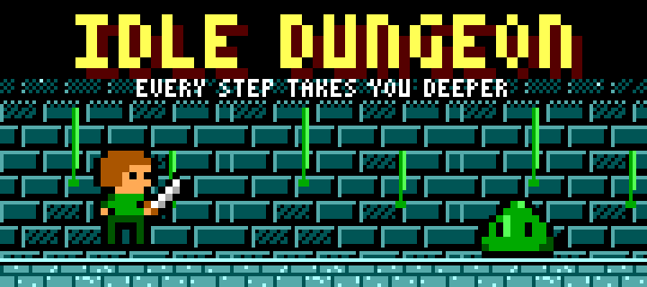
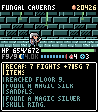
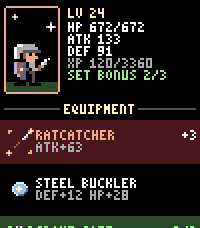
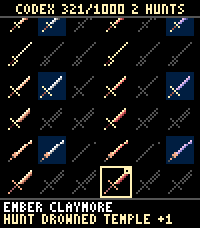
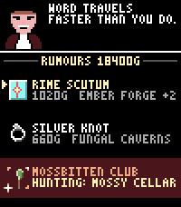
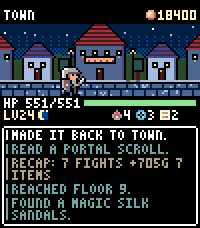
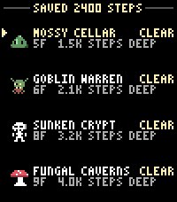

# Idle Dungeon

A hack-and-slash for the **Pebble Time 2** that runs on your step count. Pick a
dungeon in the morning and go about your day: every step carries the hero
deeper, and the app tells you what happened while you were walking.

**[Get it from the Pebble appstore](https://apps.repebble.com/38d23789644c43558635081a)**

| | | |
|---|---|---|
|  |  |  |
| Floors are hundreds of steps apart | Set and unique gear shows on the hero | 1000 items to find |
|  |  |  |
| Rumours point you at what you lack | The town turns in for the night | Eight dungeons, 1,500 to 12,000 steps deep |

## How it plays

- **Steps are the game.** Departing snapshots your step count; every step after
  that moves the hero. Steps taken in town are banked (up to 6,000) and spent on
  the next expedition, so a morning walk is never wasted.
- **Sleep counts too.** Six hours makes the hero Rested, seven Refreshed: more
  experience, more gold, better finds, for that day.
- **Loot.** 150 shapes across six materials, 64 uniques and 12 three-piece sets.
  Rare gear drops unidentified — read a scroll where you stand or take it to the
  appraiser.
- **Hunt what you are missing.** The tavern sells rumours; the codex says where
  an item drops. Bosses give up their unique after five tries at the latest.
- **Dying costs you.** Your gear stays where you fell until you walk back for it,
  pay the retrieval agent, or three days pass.

## Building

Needs the [Core Devices Pebble SDK](https://developer.repebble.com/sdk/) (the
one that knows about `emery`), on Linux or WSL.

```bash
bash build.sh                  # builds build/idle_dungeon.pbw
pebble install --emulator emery
pebble install --cloudpebble   # to a real watch, with the phone app open
```

Run the logic tests — far quicker than the emulator, and they cover the
catalogue, the maths, saves and a 30-day play simulation:

```bash
bash tools/pctest/run.sh
```

See how a long game unfolds (clearing every dungeon, filling the codex):

```bash
bash tools/pctest/sim_progress.sh 4000 rotate hunt
```

All the art is generated, not drawn in an editor:

```bash
uv run --with pillow --with qrcode python tools/gen_art.py --preview /tmp/pv
uv run --with pillow python tools/gen_store_art.py
```

## Layout

| Path | What is in it |
|---|---|
| `src/c/game.c` | rules: steps, battles, loot, the codex, rumours, saves |
| `src/c/items.h`, `items.c` | the catalogue: 150 shapes, 64 uniques, 12 sets |
| `src/c/*_window.c` | one file per screen |
| `src/c/gfx.c` | dot font, charmap drawing, item icons, rows |
| `tools/gb_*.py` | the pixel art, drawn in code |
| `tools/pctest/` | the game compiled for the PC, with tests and simulations |
| `docs/` | store listing text, screenshots, banner |

## Support

If it made a walk better, you can [buy the developer a pint](https://ko-fi.com/daipoyo).
The tavern in the game has the same link as a QR code.

## License

[MIT](LICENSE) — code and art alike. Port it, pick it apart, build on it.

---

## 日本語

歩いた歩数がそのまま冒険になる、Pebble Time 2 向けのハックアンドスラッシュです。
朝にダンジョンを決めて出発したら、あとは普段どおり歩くだけ。戦闘も拾い物も歩いている
間に起き、次にアプリを開いたときに何があったかを読みます。

1000種のアイテム図鑑、未鑑定のレア装備、セット装備と固有装備、噂を買っての狙い撃ち、
死亡時の装備喪失と回収、睡眠ボーナス、朝の出発通知などがあります。

ビルドと実行方法は上の「Building」のとおりです。
